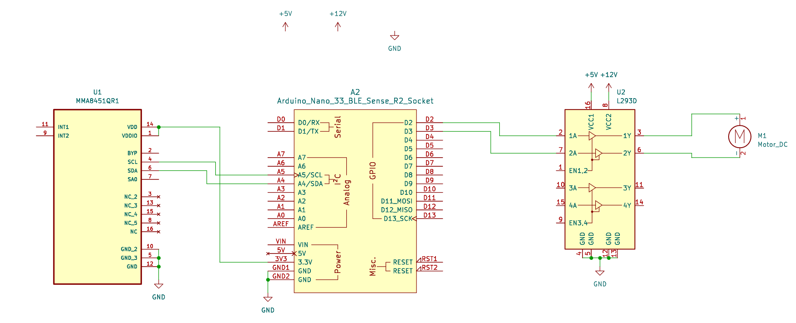

# CESAM
Simple, connected and reliable indoor Door Opening Device.

participants
Porteur projet : Vincent Pour son fils Hugo

Gabriel  
Lucie  
Clotilde  
Koji  
Samuel
Antoine

## Features
* indoor door open and close action with motor
* brake that can be released to allow manual door operation
* full features BlueTooth LowEnergy app to control door(s)
* automatic breake release on door manual movement
* door speed and current monitoring to avoid motor overheating

## Firmware
### States & transitions

## Hardware
* motor with reducer and wheel [example here](https://www.amazon.fr/Gebildet-DC3V-6V-motrices-robotique-Plastique/dp/B08D39MFN1/ref=asc_df_B08D39MFN1/?tag=googshopfr-21&linkCode=df0&hvadid=454935615577&hvpos=&hvnetw=g&hvrand=12643294058659340367&hvpone=&hvptwo=&hvqmt=&hvdev=c&hvdvcmdl=&hvlocint=&hvlocphy=9055351&hvtargid=pla-937905506568&psc=1&mcid=ba72aca812863cf9a3a4d8b4893a39b7)
* arduino nano 33 ble
* H-Bridge (L293D or DRV8838 or anything else)
* Voltage regulator

