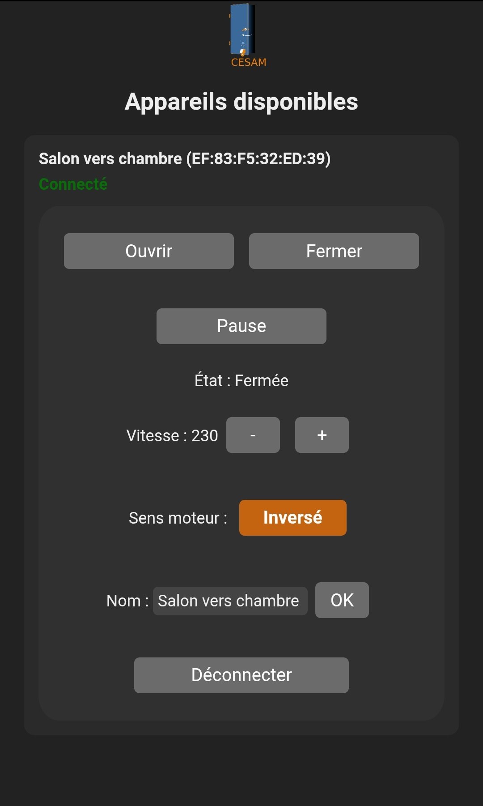

# Mobile application

## Features

* BLE connectivity
* Allows to command any BLE-wise reachable door :
  * open
  * close
  * break
  * free
* build for Android



## Build

The app is an [Apache Cordova](https://cordova.apache.org/) project living in
`cesam_application/`. Cordova itself is a `devDependency`, so there is nothing to install
globally.

### Prerequisites

| Tool | Version | Notes |
| --- | --- | --- |
| JDK | 17 | required by cordova-android 12 |
| Android SDK platform | `android-34` | matches `android-compileSdkVersion` in `config.xml` |
| Android SDK build-tools | `33.0.2` | see the pitfall below |
| Android platform-tools | any | provides `adb` |

`ANDROID_HOME` must point at the SDK directory (`export ANDROID_HOME=$HOME/Android`).

Missing SDK packages can be installed with:

```bash
$ANDROID_HOME/cmdline-tools/latest/bin/sdkmanager "platforms;android-34" "build-tools;33.0.2" "platform-tools"
```

### Building

From `cesam_application/`:

```bash
npm install                              # cordova, plugins, build tooling
npx cordova platform add android@12.0.1  # once per clone - the version pin matters, see below
npx cordova build android                # debug APK
```

The APK lands in `platforms/android/app/build/outputs/apk/debug/app-debug.apk`.

To build, install and start on a USB-connected device (check it shows up in `adb devices`
first):

```bash
npx cordova run android
npx cordova run android --release        # requires a signing key
```

`platforms/` and `plugins/` are generated directories and are git-ignored. Anything that must
survive a rebuild belongs in `config.xml`, `package.json` or `www/`.

### Pitfalls

* **Always pin the platform version.** A bare `cordova platform add android` installs the
  latest cordova-android (15.x at the time of writing), rewrites `package.json` and produces a
  project that no longer matches this one. Use `android@12.0.1`.
* **build-tools must be a 33.x release.** cordova-android 12 only looks for build-tools in the
  `[33.0.2, 34.0.0)` range, so having 34.x or 35.x installed is not enough and the build fails
  with `No installed build tools found`.
* **`cordova-plugin-whitelist` is skipped** on install (`failed version requirement:
  >=4.0.0 <10.0.0`). This is harmless - its features have been part of cordova-android for
  several major versions - but the plugin could be dropped from `package.json`.

## Android BLE permissions

`cordova-plugin-ble-central` is deliberately installed as its **`slim` variant**, pinned to an
exact version in `package.json`:

```json
"cordova-plugin-ble-central": "2.0.0-slim"
```

The slim variant ships no Android permission at all, which lets `config.xml` declare the whole
set itself - and, crucially, add `android:usesPermissionFlags="neverForLocation"` to
`BLUETOOTH_SCAN`.

That flag is what makes scanning work on Android 12 and later. Without it, the system only
delivers BLE scan results to an app that also holds a location permission; since
`ACCESS_FINE_LOCATION` / `ACCESS_COARSE_LOCATION` are capped at `maxSdkVersion="30"`, the app
holds none from Android 12 on and `ble.scan()` silently returns **zero device** - no error, no
`onScanFailed`. Since the app never derives physical location from scan results, asserting
`neverForLocation` is the correct fix.

Two things to be careful about when touching this:

* **Do not restore the `^` range** on the plugin version. `^2.0.0-slim` also matches the
  regular `2.0.0`, which would silently reintroduce the plugin's own permission block and the
  bug with it.
* **Do not try to patch the permission with `<edit-config>`.** Overwriting the plugin's
  `BLUETOOTH_SCAN` element is not idempotent: the plugin munge reinserts its own copy on the
  next `cordova prepare`, and the build then dies on
  `Element uses-permission#android.permission.BLUETOOTH_SCAN ... duplicated`.

The result can be verified on the built APK itself:

```bash
$ANDROID_HOME/build-tools/34.0.0/aapt2 dump permissions \
    platforms/android/app/build/outputs/apk/debug/app-debug.apk
```

which must list:

```
uses-permission: name='android.permission.BLUETOOTH_SCAN' usesPermissionFlags='neverForLocation'
```
